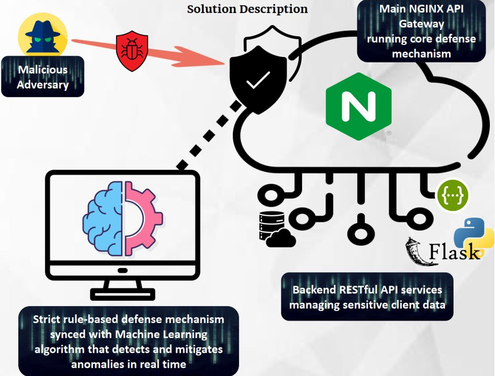

<!--  -->

  

# **Ariel University API-Security Project**

Presented by Team 27:

Shmuel Lavian, Gidon Avziz, Sivan Yahav, Koral Elbaz

Supervised by Dr. Amit Dvir and Dr. Ran Dubin

**Develop patent pending API security mechanism algorithms.**

> ## Disclaimer
> API Security project and it's innovative content are patent protected this is why unfortunately we cannot reveal the entire source code of the project.
> This repo will include a more through explanation of the project and it's motive.

-----

Today most of recent researches point out that API dominates over 60% of the overall worldwide traffic. API mechanisms are implemented in over 90% of software design in any software development company. 

These details bring API's to be one of the most favorite attack vector for hackers to gain access. In 2020 alone, 91% of organizations had an API security incident.

## Project goal

Our project is aiming to disrupt API security standards worldwide to safeguard any app-to-app communications. By using a combination of rule based and machine learning based algorithms to ensure best performance in real time.

## Design Approach

API Security systems popularity is growing constantly and cyber security incidents involving API's are becoming more and more popular as we described earlier. 

One such event that can be mentioned is the Log4J vulnerability which compromised millions of devices and servers worldwide and had such an easy exploit. Just by using two simple JAVA commands a hacker could force the remote attacked server to download and run malicious JAVA object's without any interference. Our system want's to change that. 

### Defense Mechanism

By deep analyzing each and every incoming HTTP request we will invoke a strict set of rule based analysis which will prompt and invoke a trained machine learning algorithm to pin point any incoming anomaly even if it was never researched before. 

Some of the datasets for the machine learning model are public but some of then was even generated by our API team. 

### Gateway 
All the above implementation will be running on an NGINX server which is top of the line API Gateway services these days, used by the biggest companies like Meta, Microsoft and more. This server will filter any incoming request and return the correct answer. 

### Backend

Our backend systems run state of the art API services designed internally in order to test the integrity of our system and to abide by latest market standards like REST and OpenAPI.

## Architecture

  

<!-- > QR Code created with: https://www.qrcode-monkey.com/ -->